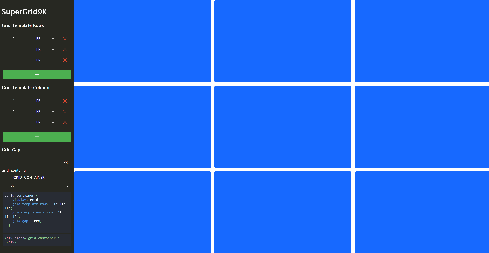

<h1 align="center">Welcome to supergrid9k 👋</h1>



<p>
  
  <a href="#" target="_blank">
    
  </a>
  <a href="https://twitter.com/garrettlweems" target="_blank">
    
  </a>
</p>

> css grid generator that is super and 9k

### 🏠 [Homepage](https://github.com/glweems/supergrid9k)

### ✨ [Demo](https://supergrid9k.dev)

## Install

```sh
yarn install
```

## Usage

```sh
yarn run start
```

## Run tests

```sh
yarn run test
```

## Author

👤 **Garrett Weems**

- Website: https://glweems.com
- Twitter: [@garrettlweems](https://twitter.com/garrettlweems)
- Github: [@glweems](https://github.com/glweems)
- LinkedIn: [@glweems](https://linkedin.com/in/glweems)

## Show your support

Give a ⭐️ if this project helped you!

---

_This README was generated with ❤️ by [readme-md-generator](https://github.com/kefranabg/readme-md-generator)_
